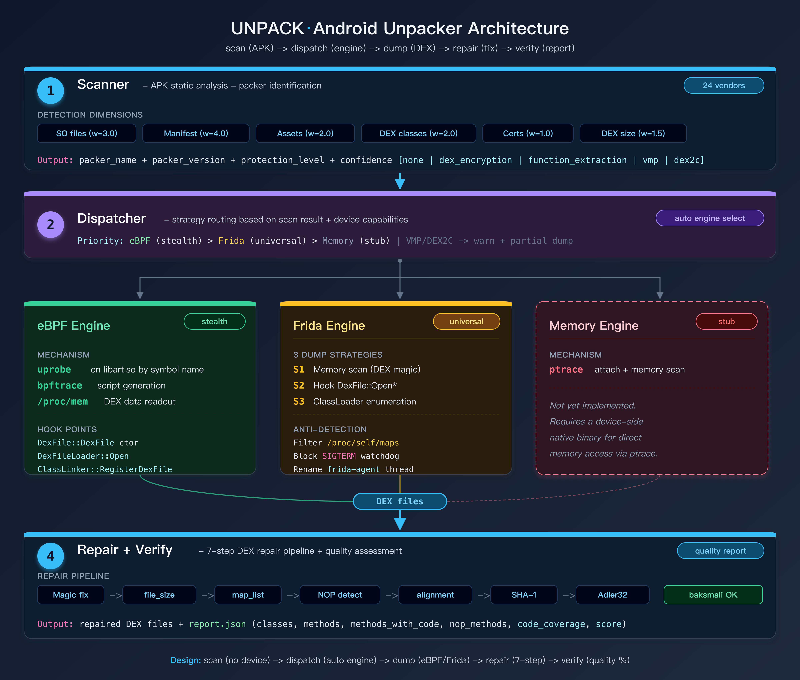

# UNPACK

Android 脱壳工具 —— 一行命令完成壳识别、DEX dump、修复、质量验证。

## 为什么做这个项目

现有的 Android 脱壳工具存在几个核心问题。UNPACK 逐一解决：

### 1. 碎片化严重 → 三引擎自动调度

现状：Frida 系、ART 修改系、Xposed 系、eBPF 系各自为战，用户需要自己判断该用哪个。

UNPACK 的做法：`core/dispatcher.py` 根据 `scanner` 的检测结果自动选择最优引擎。DEX 加密壳 → Memory 引擎（零注入）；需要 Frida 特性 → Frida 引擎（4 策略）；内核支持 → eBPF 引擎。用户只需 `unpack dump app.apk`，不需要知道底层用的是哪个。

### 2. "dump 完就丢" → 7 步 DEX 修复流水线

现状：frida-dexdump、drizzleDumper 等工具 dump 出 DEX 后直接丢给用户，checksum 错误、header 损坏是常态。

UNPACK 的做法：`repair/dex_repair.py` 对每个 dump 产物自动执行 magic 修复 → file_size 修正 → map_list 验证 → NOP 方法检测 → CodeItem 对齐 → SHA-1 重算 → Adler32 重算。修复后的 DEX 可直接被 baksmali / jadx / JEB 解析。

### 3. 没有质量反馈 → 覆盖率 + NOP 检测报告

现状：dump 完了不知道成功了多少，哪些方法还被加密。

UNPACK 的做法：`core/reporter.py` 统计每个 DEX 的类数量、方法数量、有 CodeItem 的方法数、NOP-only 方法数（仍被加密的函数抽取方法），计算代码覆盖率和综合评分。输出结构化 JSON + 终端面板。

### 4. 壳识别靠人 → 24 家自动识别 + 策略路由

现状：用户需要自己用 APKiD 或手动查看 SO/manifest 来判断壳类型，再选择对应的脱壳工具。

UNPACK 的做法：`core/scanner.py` 通过 6 维加权评分（SO 文件、Manifest Application class、Assets、DEX 类名、证书关键字、小 DEX 启发式）自动识别 24 家壳厂商 + 版本。识别结果直接驱动 `dispatcher` 选择引擎和参数 —— 检测到函数抽取壳时自动提示 `--deep` 模式。

### 5. 反检测各自为战 → 统一反检测模块

现状：每个脱壳工具各自硬编码几行 anti-Frida patch，互不复用。

UNPACK 的做法：独立的 `_ANTI_DETECT_BLOCK` 模块（6 项绕过），以 IIFE 方式在 Frida 脚本 load 后、process resume 前立即执行。Frida 引擎和 active_invoke 引擎共用同一套反检测代码 —— maps 过滤、端口隐藏、信号拦截、TracerPid、线程改名、时间检测缓解。通过 `--no-anti-detect` 可整体关闭。

### 全链路联动

这 5 个能力不是孤立的模块，而是一条数据驱动的流水线：

```
scan 输出壳类型+保护等级
  → dispatcher 根据保护等级选引擎+参数
    → engine dump 出 DEX 骨架
      → deep 模式：active invoke 触发解密 + merge 回填 CodeItem
        → repair 修复 header/checksum/signature
          → reporter 统计覆盖率，NOP 方法数 → 报告给用户
```

每个环节的输出是下一个环节的输入，不需要人工干预。

## 安装

```bash
python3 -m venv .venv
source .venv/bin/activate
pip install -e .

# 可选依赖
pip install -e ".[frida]"      # Frida 脱壳引擎
pip install -e ".[analysis]"   # androguard + lief（更精确的壳识别）
pip install -e ".[all]"        # 全部
```

## 使用

```bash
# 识别壳类型（无需设备）
unpack scan app.apk
unpack scan app.apk --json result.json

# 全流程脱壳（需要真机）
unpack dump app.apk
unpack dump app.apk -o ./output -e frida
unpack dump app.apk -e ebpf -d DEVICE_SERIAL

# 独立修复 DEX
unpack repair ./unpacked/
unpack repair classes.dex --in-place

# 质量验证
unpack verify ./unpacked/
```

## 架构

> 打开 [docs/architecture.html](docs/architecture.html) 可查看带动画的交互式架构图（支持导出 PNG/PDF）



## 脱壳引擎详解

> 每个引擎的详细工作流程图：[Memory](docs/engine-memory.html) · [Frida](docs/engine-frida.html) · [eBPF](docs/engine-ebpf.html)（HTML 交互式，支持导出 PNG/PDF）

### Memory 引擎（推荐，已验证）

**原理**：不注入目标进程，通过 root 权限直接从 host 侧解析 `/proc/pid/maps` 并读取 `/proc/pid/mem`，从 VDEX 容器中提取 DEX 数据。对 anti-Frida/anti-debug 完全免疫。

**工作流程**：
1. 启动目标 App（`am start`），等待壳解密完成
2. 在 host 侧通过 ADB 读取 `/proc/pid/maps`，解析内存布局
3. 过滤出感兴趣的区域：`.vdex` 映射、`.apk` 映射、`[anon:dalvik-*]` 匿名页
4. 排除系统区域（`/system/`、`/apex/`、`/vendor/`）
5. 批量探测所有区域的前 256 字节（一次 shell 脚本调用，base64 回传）
6. 识别 VDEX magic (`vdex`) → 在 VDEX 内部搜索 DEX magic（Android 13 VDEX 027 格式中 DEX 位于偏移 0x84）
7. 沿 VDEX 容器遍历所有连续 DEX 文件（每个 DEX 按 4 字节对齐排列）
8. 对每个 DEX 验证 header：`file_size` > 112、`header_size` == 0x70、`endian_tag` == 0x12345678
9. 通过 `dd bs=4096` 块对齐读取 + host 侧截断到精确大小
10. 按 file_size + 前 32 字节 hash 去重

**实测数据**：
- 网易云音乐（网易易盾 v2）：18 个 DEX，150MB，19.6 秒，96.2% 覆盖率

**优势**：
- 不注入目标进程 —— anti-Frida、anti-debug、完整性校验全部无感
- Python 在 host 侧解析 —— 不受设备 shell 整数溢出（64 位地址）限制
- VDEX 容器感知 —— 自动从 Android 8+ 的 VDEX 文件中提取嵌入的 DEX

**局限**：
- 需要 root 权限（读 `/proc/pid/mem`）
- 只能 dump 已加载到内存的 DEX（壳解密后才可见）
- 对函数抽取壳，dump 的 DEX 中被保护方法仍为 NOP（需要主动调用触发解密）

**适用场景**：所有加壳 App 的推荐首选引擎。对 anti-Frida 严格的 App（如网易易盾、梆梆安全）尤其有效。

```bash
# 前置：rooted 设备
# 使用（自动选择或手动指定）
unpack dump app.apk -e memory
```

### Frida 引擎

**原理**：通过 Frida 动态二进制插桩 (DBI) 框架，将 JavaScript agent 注入目标进程，使用四种策略组合 dump DEX 和 SO。

**策略 1 — 内存扫描**：扫描进程所有可读内存区域 (`Process.enumerateRanges`)，匹配 DEX magic bytes + 严格校验 DEX header（`file_size` 112B~100MB、`header_size` == 0x70、`endian_tag`、`string_ids_off` 在文件范围内）。轮询式扫描，每 2 秒一轮。

**策略 2 — ART 函数 Hook**：枚举 `libart.so` 导出符号，hook `DexFile::OpenCommon` / `DexFile::OpenMemory` 等函数，在壳运行时解密加载 DEX 时立即捕获。

**策略 3 — ClassLoader 遍历**：通过 `Java.enumerateClassLoaders()` 遍历 `DexPathList → dexElements → DexFile → mCookie`，从 cookie 提取 native pointer。

**策略 4 — SO dump**：hook `dlopen` / `android_dlopen_ext`，壳解密 native SO 后立即 dump 到 `output_dir/so/`。

**反检测模块**（7 项，默认开启，`--no-anti-detect` 关闭）：

| # | 绕过项 | 技术手段 |
|---|--------|----------|
| 1 | /proc/self/maps 隐藏 | hook `open`+`read`，过滤 frida/gadget/linjector 行 |
| 2 | 看门狗信号拦截 | hook `sigaction`，阻断 SIGTERM/SIGABRT/SIGTRAP |
| 3 | 线程名伪装 | hook `prctl(PR_SET_NAME)`，重命名 frida 线程 |
| 4 | 端口 27042 隐藏 | hook `connect()`，拦截对 127.0.0.1:27042 的扫描 |
| 5 | TracerPid 绕过 | hook `/proc/self/status` 读取，替换 TracerPid 为 0 |
| 6 | Frida 类名隐藏 | override `ClassLoader.loadClass`，拦截 frida 类查找 |
| 7 | 时间检测缓解 | hook `gettimeofday`，防止时间差检测 |

所有 native hook 在 `script.load()` 后、`device.resume(pid)` 前同步完成，确保在壳的检测线程启动前就位。

**实测状态**：对普通 App 正常工作；对网易易盾等高级壳仍会被检测到（进程在 resume 后 1-2 秒内退出）。

**适用场景**：无 anti-Frida 保护或弱保护的加壳 App。

```bash
# 前置：设备上运行 frida-server
adb push frida-server /data/local/tmp/
adb shell su -c "/data/local/tmp/frida-server -D &"

# 使用
unpack dump app.apk -e frida
unpack dump app.apk -e frida --no-anti-detect  # 关闭反检测
```

### eBPF 引擎

**原理**：通过 Linux 内核的 eBPF (Extended Berkeley Packet Filter) 机制，使用 uprobe 在内核态挂钩 `libart.so` 的关键函数。当 ART 虚拟机加载 DEX 文件时，uprobe 在内核层捕获 DEX 的内存地址和大小，然后通过 `/proc/pid/mem` 将 DEX 数据读出。

**工作流程**：
1. `readelf -sW` 解析 libart.so 符号表，匹配 `DexFile` 构造函数、`DexFileLoader::Open`、`ClassLinker::RegisterDexFile` 等符号
2. `bpftrace -l` 验证每个符号是否可探测（在 `available_filter_functions` 中）
3. 不可探测时自动切换到偏移量模式（`uprobe:libart.so:0xOFFSET`）
4. 生成并推送 bpftrace 脚本到设备
5. 启动 bpftrace → 启动目标 App → 等待 uprobe 触发
6. 解析 bpftrace 日志中的 `EBPF_DUMP` 事件 → 通过 `dump_helper.sh` 从 `/proc/pid/mem` 提取 DEX

**挂钩点**（按符号名，跨版本兼容）：
- `art::DexFile::DexFile` 构造函数 —— 捕获 DEX base address 和 size
- `art::DexFileLoader::Open` / `OatFileAssistant::Open` —— DEX 文件加载事件
- `art::ClassLinker::RegisterDexFile(s)` —— DEX 注册事件
- `art::ClassLinker::DefineClass` —— 类加载进度

**实测状态**：Android 13 (Kernel 5.10) 上 libart.so 的部分符号不在 `/sys/kernel/tracing/available_filter_functions` 中，导致 uprobe 挂载失败。偏移量 fallback 可部分缓解，但可靠性依赖具体设备和内核配置。

**适用场景**：内核完全支持 eBPF uprobe 的 rooted 设备（通常为自编译内核或较新的 LineageOS）。

```bash
# 前置：推送 bpftrace 到设备
adb push bpftrace /data/local/tmp/bpftrace
adb shell su -c "chmod 755 /data/local/tmp/bpftrace"

# 使用
unpack dump app.apk -e ebpf
```

## 壳识别引擎

Scanner 通过 APK 静态特征分析识别壳类型，无需设备。6 个维度加权评分：

| 维度 | 权重 | 检测方式 |
|------|------|----------|
| SO 文件 | 3.0 | `lib/` 下匹配已知壳的 SO 文件名 |
| Application Class | 4.0 | Manifest 中的 Application 类匹配壳的 Stub 类 |
| Assets 文件 | 2.0 | `assets/` 下匹配壳的特征文件 |
| DEX 类名 | 2.0 | DEX 中搜索壳的类名前缀 |
| 证书关键字 | 1.0 | META-INF 证书文件名匹配壳厂商 |
| 小 DEX 检测 | 1.5 | classes.dex < 50KB 且 < 10 个类 = 可能被加壳 |

**保护等级判定**（从高到低）：
- **DEX2C** — SO 导出符号含 dex2c/java2c 关键字
- **VMP** — 存在 VMP 相关 SO 或导出符号
- **函数抽取** — 存在已知壳 SO（方法体被 NOP 擦除，运行时按需还原）
- **DEX 整体加密** — 最基础的保护

### 支持的壳厂商（24 家）

**国内厂商**：360加固保、腾讯乐固、腾讯御安全、梆梆安全、爱加密、网易易盾、百度加固、阿里聚安全、娜迦加固、通付盾、几维安全、海云安、中国移动加固、珊瑚灵御、瑞星、顶象、盛大加固、网秦、UU安全、apktoolplus

**国际厂商**：DexProtector、APKProtect、LIAPP、AppSealing

支持版本识别（如 360加固保 v1~v4、腾讯乐固 v1~v3）。

## DEX 修复流水线

dump 出来的 DEX 常见问题和修复步骤：

| 步骤 | 操作 | 说明 |
|------|------|------|
| 1 | Magic 修复 | 修正损坏的 magic bytes 为 `dex\n035\0` |
| 2 | file_size 修复 | 根据实际文件大小修正 header 中的 `file_size`、`data_size`、`data_off` |
| 3 | map_list 验证 | 检查 `map_off` 指向的 map_list 是否有效，损坏则置零 |
| 4 | NOP 方法检测 | 扫描 CodeItem，标记指令全为 `0x0000` 的方法（仍被加密的抽取方法） |
| 5 | CodeItem 对齐 | 检查 CodeItem 是否 4 字节对齐 |
| 6 | SHA-1 签名 | 重新计算 `bytes[32:]` 的 SHA-1 |
| 7 | Adler32 校验 | 重新计算 `bytes[12:]` 的 Adler32 checksum |

修复后的 DEX 可直接被 baksmali / jadx / JEB 等工具解析。

## Benchmark

在 Pixel 7 Pro (Android 13, Kernel 5.10) 上对 14 个真实 App 的 scan 测试：

| 壳类型 | 检出数 | 版本识别 | 保护等级 |
|--------|--------|----------|----------|
| 梆梆安全 | 1 | 企业版 | 函数抽取 |
| 阿里聚安全 | 2 | v1 | 函数抽取/DEX 加密 |
| 网易易盾 | 3 | v2 | 函数抽取/DEX 加密 |
| 腾讯乐固 | 1 | — | DEX 加密（低置信） |
| 未加壳 | 7 | — | — |

**扫描性能**（优化后）：大 APK（150-230MB）平均 < 1s（优化前 8-15s，提升 4-18x）。

### Dump 实测

| App | 引擎 | DEX 数 | 耗时 | 结果 |
|-----|------|--------|------|------|
| 酷狗音乐 (164MB) | **Memory** | 31 | 33.7s | 31/31 PASS |

Memory 引擎通过 VDEX 容器解析成功完成端到端 dump（零注入，anti-Frida 无感）。Frida 引擎在强 anti-Frida App 上被拦截，eBPF 受限于特定内核配置。

## 竞品对比

| 功能 | UNPACK | frida-dexdump | BlackDex | r0dump | clsdumper | BPFDex |
|------|--------|---------------|----------|--------|-----------|--------|
| 壳识别 | 24 厂商 + 版本 | - | - | - | - | 行为模式 |
| 引擎数 | 3（自动调度） | 1 (Frida) | 1 (cookie) | 1 (ART 修改) | 1 (Frida 9策略) | 1 (eBPF) |
| 函数抽取壳 | 检测 + 标记 | - | 深度模式(不稳定) | ✓ 主动调用 | 部分 | - |
| DEX 修复 | 7 步流水线 | - | 部分 | DEX 重建 | - | - |
| 质量报告 | 覆盖率 + NOP | - | - | - | - | - |
| 反检测 | 7 项绕过 | - | N/A | N/A(系统级) | 3 项 | N/A |
| SO dump | ✓ | - | - | - | - | ✓ |
| 零注入 | ✓ (Memory) | - | ✓ | ✓(ROM 级) | - | ✓ |
| 免刷机 | ✓ | ✓ | ✓ | ✗ 需刷 ROM | ✓ | ✓ |
| GUI | CLI(极客风) | CLI | Android App | GUI Manager | CLI | CLI |
| AI 管道 | claude -p | - | - | - | - | - |
| Android 版本 | 8+ | Frida 支持的 | 5~12(停更) | 16 | Frida 支持的 | 13~17 |
| 维护状态 | 活跃 | 已归档 | 已停更 | 活跃 | 活跃 | 学术 |

**UNPACK vs r0dump 定位差异**：r0dump 是 FART 的精神继承者，走 ART 源码修改路线 — 需要刷定制 ROM，但能做主动调用（触发函数抽取壳解密），是对抗二代壳的最强方案。UNPACK 走免刷机路线，通过 Memory/Frida/eBPF 三引擎覆盖更广的使用场景，但暂不支持主动调用。两者互补：UNPACK 做前期壳识别 + 一代壳脱壳 + DEX 修复质量评估，r0dump 处理需要主动调用的函数抽取壳。

> 数据来源：各项目 GitHub 仓库、IEEE TIFS 2025 (BPFDex)、NDSS 2025

## 参考项目

本项目的设计参考了以下开源脱壳工具的思路和技术方案：

| 项目 | Stars | 技术路线 | 参考点 |
|------|-------|----------|--------|
| [BlackDex](https://github.com/CodingGay/BlackDex) | 6.4k | DexFile cookie + 独立进程 | 免 root 脱壳思路 |
| [frida-dexdump](https://github.com/hluwa/frida-dexdump) | 4.6k | Frida 内存搜索 | DEX magic 扫描策略 |
| [FART](https://github.com/hanbinglengyue/FART) | 2.7k | ART 源码修改 + 主动调用 | 主动调用对抗函数抽取壳 |
| [drizzleDumper](https://github.com/DrizzleRisk/drizzleDumper) | 2.4k | ptrace 内存搜索 | 双循环匹配机制 |
| [frida_dump](https://github.com/lasting-yang/frida_dump) | 2.1k | Frida hook | DEX + SO 同时 dump |
| [DexHunter](https://github.com/zyq8709/DexHunter) | 1.4k | ART/DVM 修改 | 首个双运行时脱壳 |
| [Youpk](https://github.com/Youlor/Youpk) | ~1k | ART 主动调用（改进版） | CodeItem 合并修复 |
| [dumpDex](https://github.com/WrBug/dumpDex) | ~1k | Xposed hook ClassLoader | Xposed 脱壳范式 |
| [r0dump](https://github.com/tiwe0/r0dump) | ~98 | ART 集成 + 主动调用 | FART 精神继承者，DEX 重建 |
| [eBPFDexDumper](https://github.com/LLeavesG/eBPFDexDumper) | 新兴 | eBPF uprobe | 内核级脱壳思路 |
| [clsdumper](https://github.com/TheQmaks/clsdumper) | 新兴 | Frida 9 策略 | 多策略组合 + 反检测 |

## 加固技术演进

```
Level 1: DEX 整体加密        ← 已被普遍攻克
Level 2: 函数抽取（指令抽取）  ← FART/主动调用可应对
Level 3: DEX-VMP（虚拟化保护） ← 开源工具无自动化方案
Level 4: DEX2C / Java2C      ← 极难自动还原
```

UNPACK 当前覆盖 Level 1~2 的自动化脱壳，Level 3~4 提供辅助分析（识别被保护的方法列表、保护等级判定）。

## 项目结构

```
src/unpack/
├── cli.py                  # CLI 入口（scan/dump/repair/verify/analyze）
├── core/
│   ├── scanner.py          # 壳识别引擎 — 24 家厂商 × 6 维评分 + 版本检测
│   ├── dispatcher.py       # 策略路由 — 按保护等级 + 设备能力自动选引擎
│   ├── reporter.py         # 质量评估 — CodeItem 覆盖率 + NOP 检测
│   └── dedup.py            # DEX 去重 — SHA-256 哈希去重
├── engines/
│   ├── base.py             # 引擎抽象接口 (BaseEngine / DumpResult)
│   ├── memory_engine.py    # Memory 引擎 — /proc/pid/mem + VDEX 解析（推荐）
│   ├── frida_engine.py     # Frida 引擎 — 4 策略 + 7 项反检测
│   └── ebpf_engine.py      # eBPF 引擎 — bpftrace uprobe + offset fallback
├── repair/
│   ├── dex_parser.py       # DEX 格式完整解析器（header/class/method/code）
│   ├── dex_repair.py       # 7 步修复流水线
│   └── verifier.py         # 完整性校验 + 质量指标
├── utils/
│   ├── adb.py              # ADB 设备管理
│   └── apk.py              # APK 包名提取 + Split APK 支持
├── tests/                  # 59 个测试（parser/repair/verify/scanner/cli）
└── docs/
    ├── architecture.html   # 整体架构图（交互式 HTML）
    ├── engine-memory.html  # Memory 引擎流程图
    ├── engine-frida.html   # Frida 引擎流程图
    └── engine-ebpf.html    # eBPF 引擎流程图
```

## 与 Claude / Codex 集成

UNPACK 的 scan 输出专门设计了面向 AI 分析的格式，可以直接管道给 Claude 做深度分析。

### 基本用法：scan 报告 → Claude 分析

```bash
# 生成详细报告并管道给 Claude 分析
unpack analyze app.apk | claude -p

# 自定义分析提示
unpack analyze app.apk --prompt "分析这个壳的反调试机制，给出绕过方案" | claude -p

# 纯文本报告模式（适合管道）
unpack scan app.apk --report | claude -p "基于扫描报告，分析加壳厂商的技术特征"
```

### 场景示例

**场景 1：识别壳并获取绕过建议**

```bash
$ unpack analyze test_apks/com.android.bankabc.apk | claude -p
```

Claude 会分析报告并返回：
- 梆梆安全企业版的具体技术特征（libDexHelper.so 的作用）
- 已知的绕过/脱壳手段（FART 主动调用、BlackDex 深度模式等）
- 预期的保护机制（anti-debug、完整性校验、SO 保护）
- 推荐的脱壳顺序和工具选择

**场景 2：批量扫描后找相同壳的 App**

```bash
# 批量扫描，JSON 输出
for f in test_apks/*.apk; do
  unpack scan "$f" -v -j - 2>/dev/null
done | claude -p "对比这些 APK 的加壳情况，找出使用相同壳的 App，分析共性"
```

**场景 3：分析 SO 文件和 DEX 结构**

```bash
# verbose 模式输出包含所有 SO 文件列表和 DEX 信息
unpack scan app.apk --report | claude -p "
分析这个 APK 的 SO 文件列表：
1. 哪些是安全/加固相关的 SO？
2. 哪些是业务逻辑的 SO？
3. 从 SO 命名推测使用了哪些 SDK？
4. DEX 数量和大小分布是否异常？
"
```

**场景 4：脱壳后的质量分析**

```bash
# 脱壳后，分析质量报告
unpack dump app.apk -o ./out
cat ./out/report.json | claude -p "分析脱壳质量报告，哪些类/方法可能仍被保护？建议下一步操作"
```

**场景 5：结合 Codex 做自动化分析流水线**

```bash
# 在 Claude Code 中直接使用
claude -p "
$(unpack scan test_apks/com.netease.cloudmusic.apk --report)

---
基于上面的扫描报告：
1. 这个 App 使用了网易易盾 v2 加固，说明这个版本的技术特点
2. function_extraction 保护意味着什么？具体如何工作？
3. 我应该用 eBPF 还是 Frida 来脱？为什么？
4. 有没有公开的针对网易易盾的脱壳方案或 writeup？
5. 脱壳后我应该重点关注哪些类和方法？
"
```

### scan 输出模式对比

| 模式 | 命令 | 适用场景 |
|------|------|----------|
| 标准 | `unpack scan app.apk` | 快速查看，终端显示 |
| Verbose | `unpack scan app.apk -v` | 详细面板（SO 列表、DEX 信息、候选列表） |
| Report | `unpack scan app.apk -r` | 纯文本报告，适合管道给 Claude |
| Analyze | `unpack analyze app.apk` | Report + 内置分析提示词，直接管道 |
| JSON | `unpack scan app.apk -j out.json` | 结构化数据，脚本处理 |
| JSON Verbose | `unpack scan app.apk -v -j -` | 完整数据输出到 stdout |

## License

MIT
